PROJECT DEMO:

Single-view home page:  

Add URL manually for short link:  
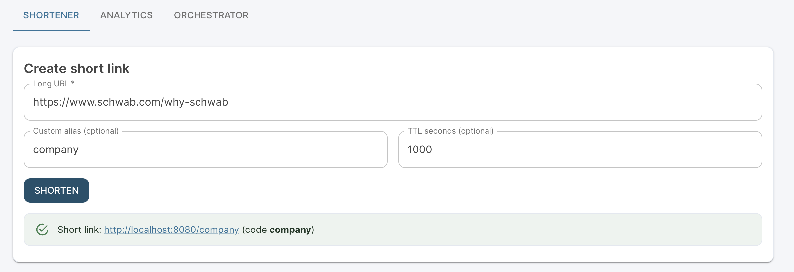

Analytics: (To view link stats and total URLs list)  
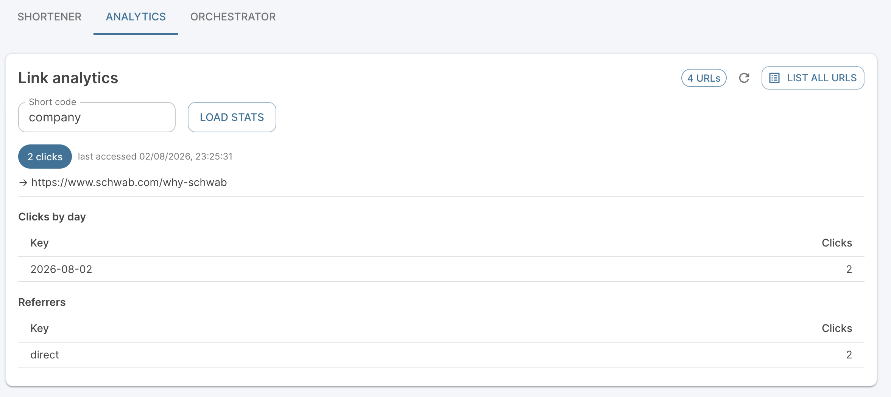

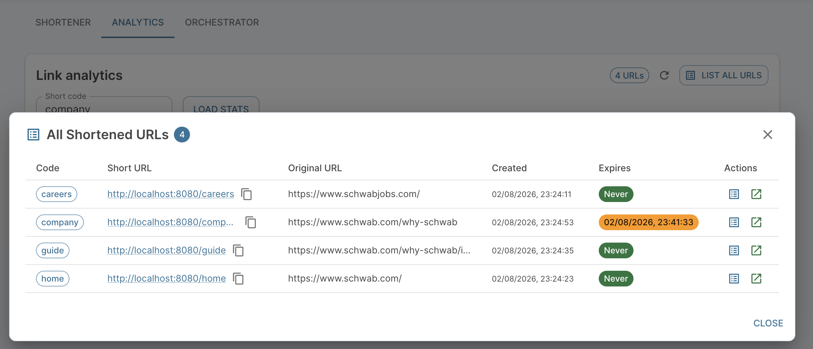

Agentic Orchestration: (Human-in-loop for approvals before submitting)

STEP 1: Submit URL Shorten based on Prompt based on Greenfield\\Brownfield\\Ambiguous   
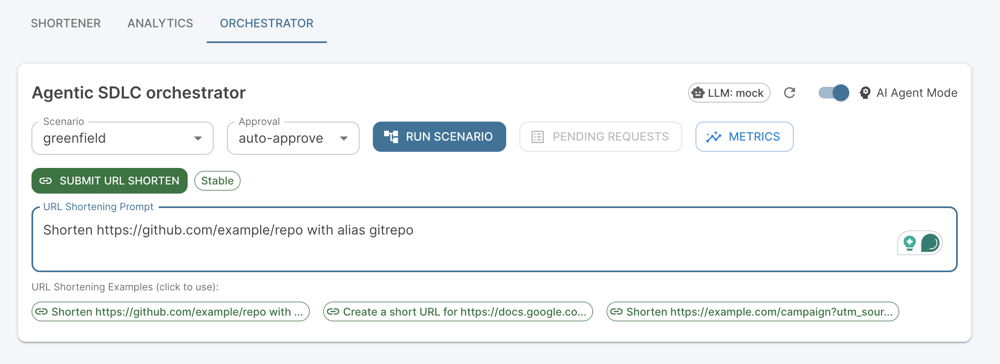

STEP 2: Check the Metrics to view the Health check.  
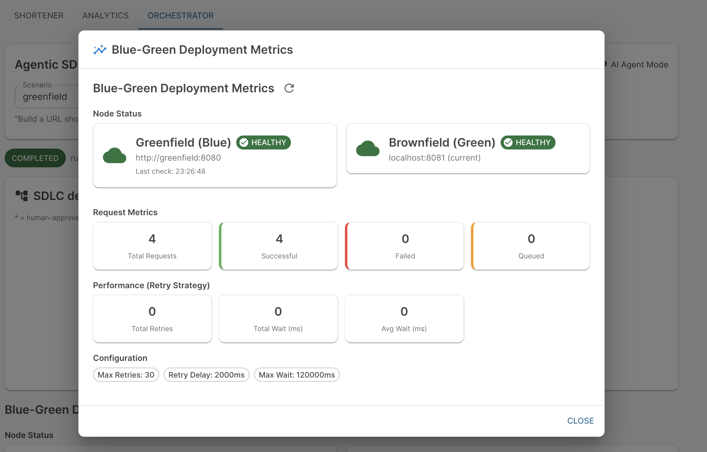

STEP 3: Intentionally stop the Greenfield node before submitting URL request to check full managed orchestration for resiliency.  
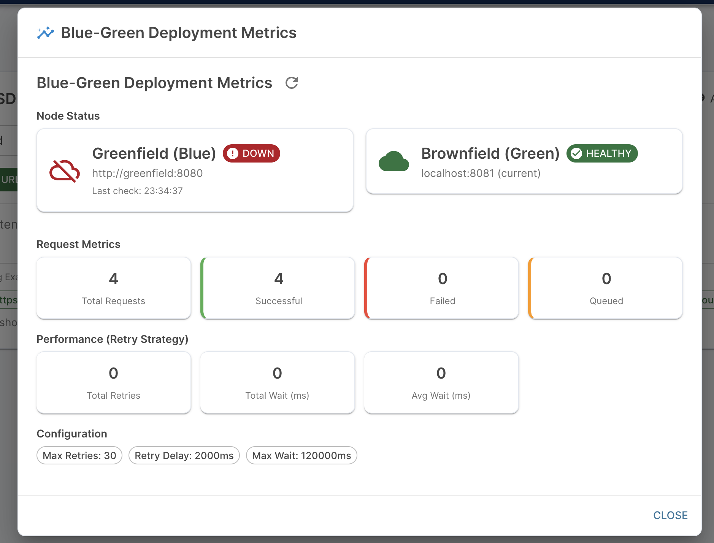

STEP 4: Make use of examples and update the URL\\Alias\\TTL. Submit the prompt while greenfield is down.  
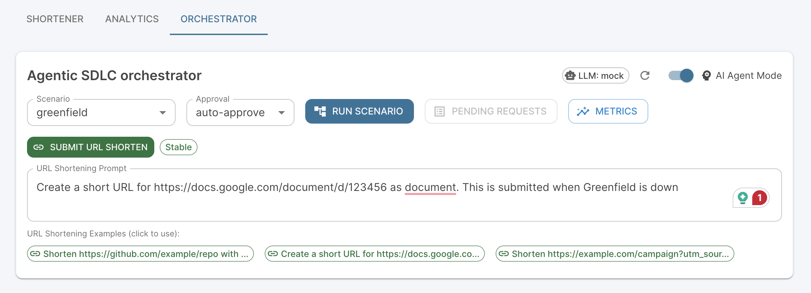

STEP 5: Request pending for approval  
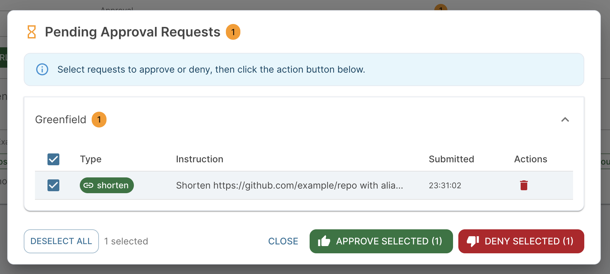

STEP 6: Though request approved but it is still waiting for the Greenfield service to come up\! in-progress bar is loading.

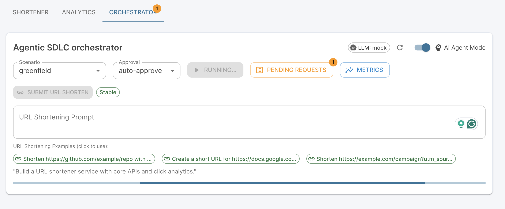

STEP 7: Request waiting in queue till Greenfield recovers in Orchestration without failure  
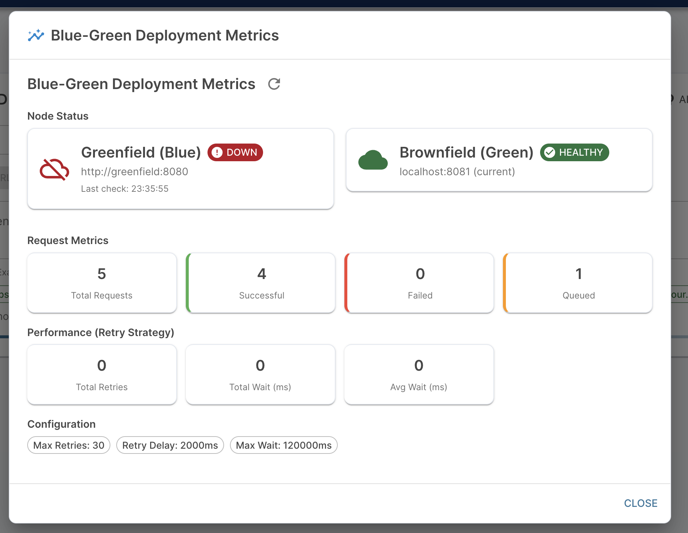

STEP 8: Greenfield node is healthy, and the request got completed after 8 retries.  
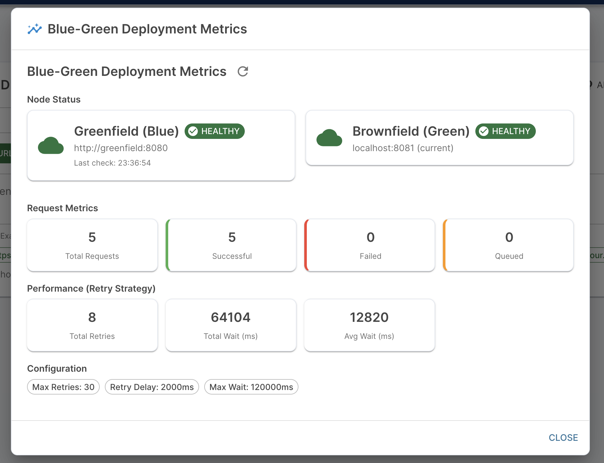

STEP 9: Fully Autonomous managed request submission without any approvals. (Beta \- still in progress)  
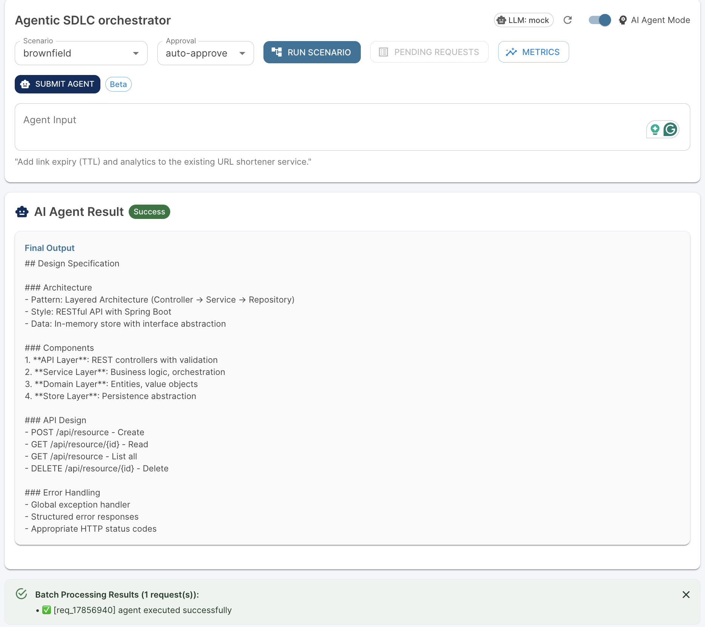

STEP 10: SWAGGER APIs for the URL services  
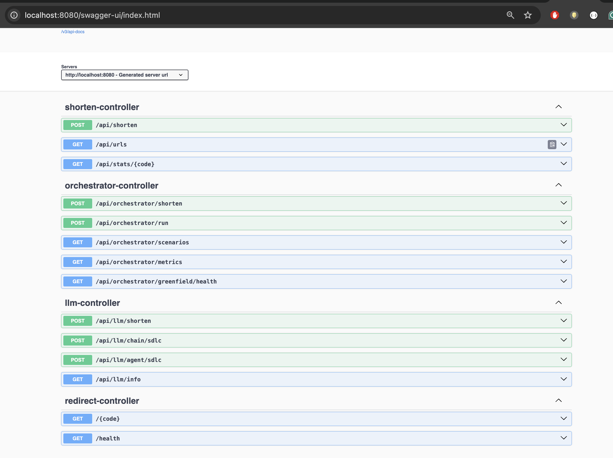

STEP 11: Fully resilient deployed service in Docker  
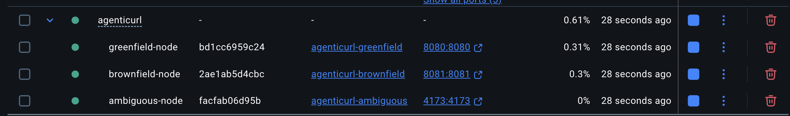
