**Setting environment: (LOCAL \+ PROD \+ LLM)**

**LOCAL SETUP:**  
Ui command:  (Project root folder)

1) cd ui  
2) npm install (if error install node js)  
3) Npm run build  
4) Npm run dev

URL \- [http://localhost:5174/](http://localhost:5174/)  
Application \- [http://localhost:8080/swagger-ui/index.html\#/](http://localhost:8080/swagger-ui/index.html#/)  
Health \- [http://localhost:8080/health](http://localhost:8080/health)

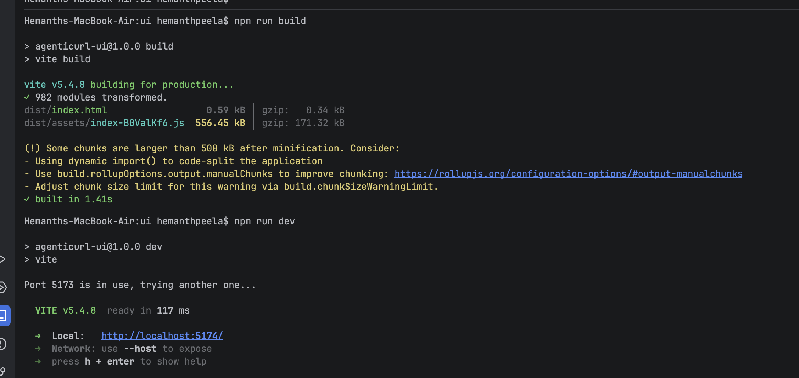

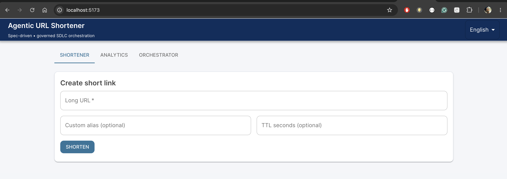

**PROD STEP:**  
Docker command:

1) docker \-v (If error install docker in the local)  
2) docker compose build

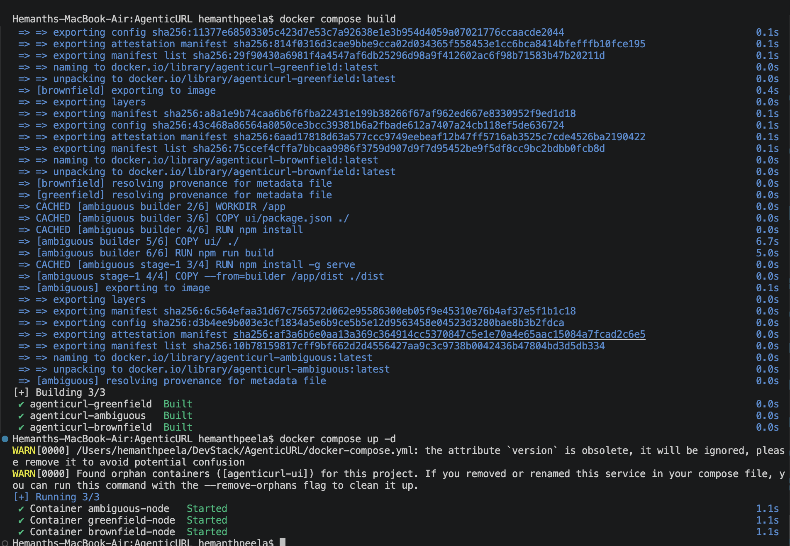

3) docker compose up \-d

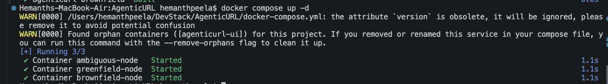

Greenfield URL \- [http://localhost:8080/swagger-ui/index.html](http://localhost:8080/swagger-ui/index.html)  
Brownfield URL \- [http://localhost:8081/swagger-ui/index.html](http://localhost:8081/swagger-ui/index.html)  
Frontend UI \- [http://localhost:4173](http://localhost:4173/)  

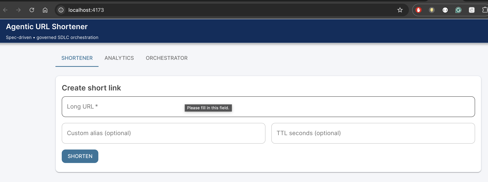

**AI Mode \- LLM Support (Enable Ollama to run it locally free of cost)**

1) Go to file \- LlmConfig.java  
2) Changes these properties

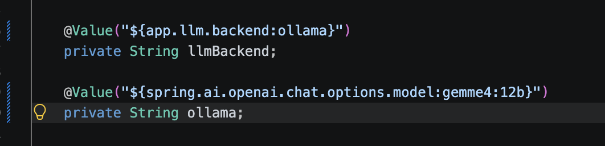

3) Check the model installed locally \- ollama list (In command prompt)

Model \- gemma4:12b  
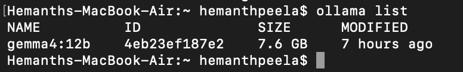

4) Change the “ollama” remove quotes

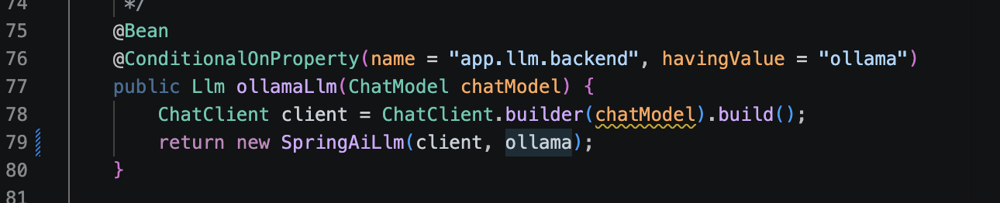

5) Comment OpenAI **line 54** and uncomment Ollama **line 60**, in build.gradle

6) Update the application properties

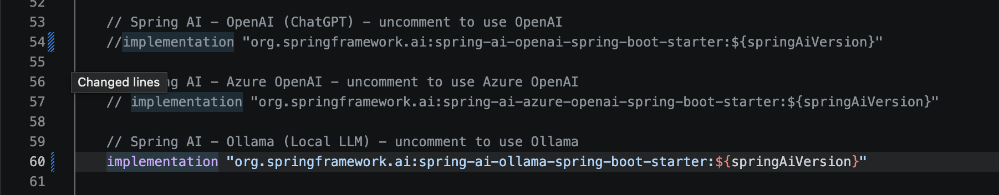

7) Run the spring boot application and NPM from first page.

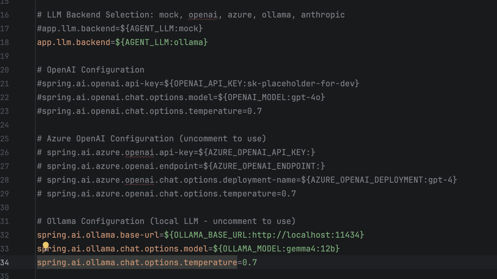
	

8) Load the application and check the model.   
   

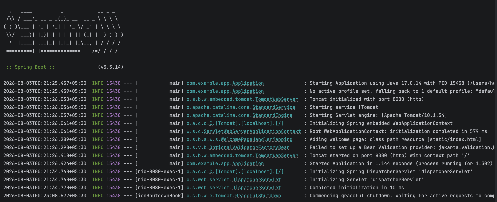
